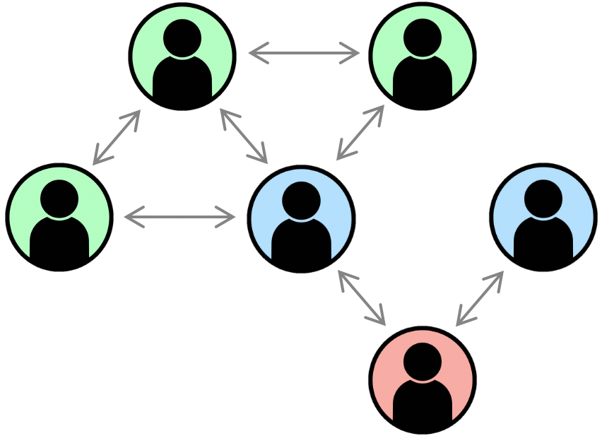
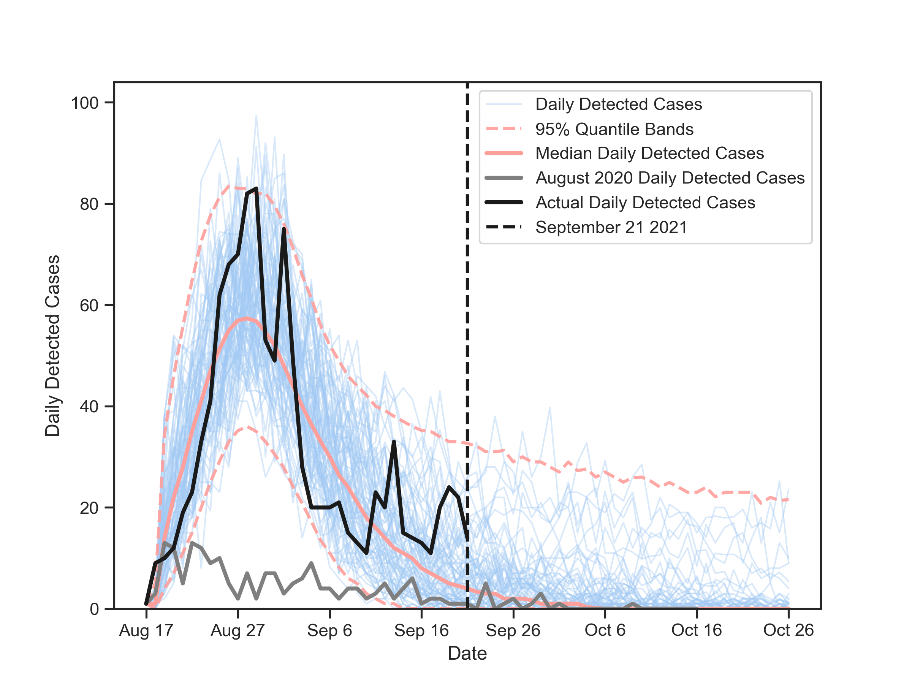

<!-- PROJECT SHIELDS -->
<!--
*** I'm using markdown "reference style" links for readability.
*** Reference links are enclosed in brackets [ ] instead of parentheses ( ).
*** See the bottom of this document for the declaration of the reference variables
*** for contributors-url, forks-url, etc. This is an optional, concise syntax you may use.
*** https://www.markdownguide.org/basic-syntax/#reference-style-links
-->
[![Contributors][contributors-shield]][contributors-url]
[![Forks][forks-shield]][forks-url]


<!-- PROJECT LOGO -->
<br />
<div align="center">
  <a href="https://github.com/SpeedyCovidSim/SIR_Models">
    
  </a>

<h3 align="center">Efficient Stochastic Simulation of Epidemics</h3>

  <p align="center">
    This repository contains code used to produce results found in Honour's project reports by Joel Trent and Joshua Looker. Additionally, it contains outputs used in reports by Te Pūnaha Matatini for modelling New Zealand's August 2021 COVID-19 outbreak.
    <br />
    <a href="https://github.com/SpeedyCovidSim/SIR_Models"><strong>Explore the docs »</strong></a>
    <br />
    <br />
    <a href="https://github.com/SpeedyCovidSim/SIR_Models/issues">Report Bug</a>
    ·
    <a href="https://github.com/SpeedyCovidSim/SIR_Models/issues">Request Feature</a>
  </p>
</div>


<!-- TABLE OF CONTENTS -->
<details>
  <summary>Table of Contents</summary>
  <ol>
    <li>
      <a href="#about-the-project">About The Project</a>
      <ul>
        <li><a href="#built-with">Built With</a></li>
      </ul>
    </li>
    <li>
      <a href="#getting-started">Getting Started</a>
      <ul>
        <li><a href="#prerequisites">Prerequisites</a></li>
        <li><a href="#installation">Installation</a></li>
      </ul>
    </li>
    <li><a href="#usage">Usage</a></li>
    <li><a href="#contact">Contact</a></li>
    <li><a href="#acknowledgments">Acknowledgments</a></li>
  </ol>
</details>


<!-- ABOUT THE PROJECT -->
## About The Project

This project contains the code and algorithms used for the Joel Trent and Joshua Looker's Honours Project. Apart from the very initial set of scripts, all code was produced separately - Joshua worked exclusively in Python, while Joel worked in Julia, with a couple of scripts that used Python. 

<div align="center">

</div>


### Joshua's Report:
Functions  used to produce results in his report can be found in:
*

### Joel's Report:
All .jl files and .py files written have headers described the module / script / set of functions and what they are used for. There are several plotting functions within separate modules in the directory that are not referenced below.
Functions used to produce results in his report as well as folders with graphs can be found in:

#### Section 2 - Efficient Implementation of Standard Contagion Network Algorithms
* **sirModels.jl** - implementations of Gillespie algorithms both on and not on networks.
* **sirNetworkMain.jl** - main script for the contagion network model. CN algorithm benchmarking and outputs of single realisations with increasing population size.
* **BenchmarkingPyVsJl.jl** - script used for benchmarking Julia vs Python implementations of the Gillespie Direct Method on a well-mixed implicit network.
* **ODEVerifySoln.jl** - script and functions used for verifying CN implementations against the SIR Model's ODE in the well-mixed network case.
* **verifiedOD**E - folder with CN algorithm graphs against ODE solutions.
* **Benchmarks** - folder with CN algorithm benchmarking graphs.
* **juliaGraphs** - folder with sub folders of simulation realisations for different network cases (if network or wellMixed in the name it is for this section). 

#### Section 3 - Development of Efficient Branching Process Algorithms
* **branchingProcesses.jl** - implementations of branching process algorithms used to simulate TPM's branching process model. 

#### Section 4 - Validation and Comparison of Branching Process Algorithms
* **main_branchingProcess.jl** - script and functions (main function) used to create all branching process outputs. Benchmarking of branching process algorithms.
* **BPVerifySolutions.jl** - module containing the primary function used to verify and compare branching process algorithms.
* **verifiedBranch** - folder with BP algorithm graphs against geometric solutions and each other to verify them.
* **Benchmarks** - folder with BP algorithm benchmarking graphs.
* **juliaGraph**s - folder with sub folders of simulation realisations for different branching process cases (if branch in the name it is for this section).

#### Section 5 - Branching Process Applications – NZ’s August 2021 COVID-19 Outbreak
* **main_branchingProcess.jl** - functions for model (ensemble) simulation and postprocessing of outputs used by TPM.
* **outbreakPostProcessing.jl** - functions used for post processing outputs, notably CSVs of model realisations. 
* **August2020OutbreakFit** - folder with simulation outputs from matching the August 2020 COVID-19 Outbreak data. Including matching the model output from TPM's model.
* **August2021Outbreak** - folder with all simulation outputs (including CSVs of model realisations - at least the ones that were small enough for GitHub) from simulation of this outbreak.

 <p align="right">(<a href="#top">back to top</a>)</p>

### Built With (Python)


### Built With (Julia)

* [LightGraphs](https://github.com/sbromberger/LightGraphs.jl)
* [TrackingHeaps](https://github.com/henriquebecker91/TrackingHeaps.jl)
* [DataFrames and CSV](https://github.com/JuliaData)
* [Distributions and StatsBase](https://github.com/JuliaStats)
* [Dierckx](https://github.com/kbarbary/Dierckx.jl)
* [PyCall, Pyplot and Seaborn](https://github.com/JuliaPy)
* [PlotlyJS](https://github.com/JuliaPlots/PlotlyJS.jl)
* [DifferentialEquations](https://github.com/SciML/DifferentialEquations.jl)
* [BenchmarkTools](https://github.com/JuliaCI/BenchmarkTools.jl)
* [ProgressMeter](https://github.com/timholy/ProgressMeter.jl)


<p align="right">(<a href="#top">back to top</a>)</p>


<!-- GETTING STARTED -->
## Getting Started

To get a local copy up and running follow these simple example steps.

### Prerequisites (Python)
* 


### Prerequisites (Julia)

* Julia, visit [https://julialang.org/downloads/](https://julialang.org/downloads/) to download. 
* Packages used within the project. Install them using the following in an open Julia environment.
    ```sh
   Pkg.add("InsertPackageNameHere")
   ```
* Branching process conditioning / model fitting was done using an external private GitHub repository belonging to supervisor Oliver Maclaren and Frankie Patten-Elliot. It is not necessary, but is required for postprocessing of the more recent branching process simulation outputs used for the outbreak modelling. Additionally, due to GitHub file limits, the most recent simulation CSVs (contact tracing ensemble) are not available in this repository and so some CSV loading within `augustOutbreakPostProcess()` will not work. 

### Installation

1. Clone the repo
   ```sh
   git clone https://github.com/SpeedyCovidSim/SIR_Models.git
   ```
2. Install needed packages

<p align="right">(<a href="#top">back to top</a>)</p>


<!-- USAGE EXAMPLES -->
## Usage

For Joel's code, the files with 'main' in the name (e.g. main_branchingProcess.jl and sirNetworkMain.jl) contain the `main()` functions that call the vast majority of the other functions used to produce outputs within his report. It is recommended that these functions are looked at first when considering how to use and call different algorithms, models and produce simulation outputs.  

<!-- USAGE EXAMPLES Use this space to show useful examples of how a project can be used. Additional screenshots, code examples and demos work well in this space. You may also link to more resources. 

_For more examples, please refer to the [Documentation](https://example.com)_ -->


<!-- CONTACT -->
## Contact

Joel Trent - jtre998@aucklanduni.ac.nz

Joshua Looker - jloo188@aucklanduni.ac.nz

Project Link: [https://github.com/SpeedyCovidSim/SIR_Models](https://github.com/SpeedyCovidSim/SIR_Models)

<p align="right">(<a href="#top">back to top</a>)</p>


<!-- ACKNOWLEDGMENTS -->
## Acknowledgments

* Produced for Te Pūnaha Matatini [https://www.tepunahamatatini.ac.nz/](https://www.tepunahamatatini.ac.nz/)
* For the Honours project from the Department of Engineering Science, University of Auckland [https://www.auckland.ac.nz/en/engineering/about-the-faculty/engineering-science.html](https://www.auckland.ac.nz/en/engineering/about-the-faculty/engineering-science.html)
* With supervision from Oliver Maclaren, David Wu, Dion O'Neale and Emily Harvey

<p align="right">(<a href="#top">back to top</a>)</p>


<!-- MARKDOWN LINKS & IMAGES -->
<!-- https://www.markdownguide.org/basic-syntax/#reference-style-links -->
[contributors-shield]: https://img.shields.io/github/contributors/SpeedyCovidSim/SIR_Models.svg?style=for-the-badge
[contributors-url]: https://github.com/SpeedyCovidSim/SIR_Models/graphs/contributors
[forks-shield]: https://img.shields.io/github/forks/SpeedyCovidSim/SIR_Models.svg?style=for-the-badge
[forks-url]: https://github.com/SpeedyCovidSim/SIR_Models/network/members
[stars-shield]: https://img.shields.io/github/stars/SpeedyCovidSim/SIR_Models.svg?style=for-the-badge
[stars-url]: https://github.com/SpeedyCovidSim/SIR_Models/stargazers
[issues-shield]: https://img.shields.io/github/issues/SpeedyCovidSim/SIR_Models.svg?style=for-the-badge
[issues-url]: https://github.com/SpeedyCovidSim/SIR_Models/issues
[license-shield]: https://img.shields.io/github/license/SpeedyCovidSim/SIR_Models.svg?style=for-the-badge
[license-url]: https://github.com/SpeedyCovidSim/SIR_Models/blob/master/LICENSE.txt
[linkedin-shield]: https://img.shields.io/badge/-LinkedIn-black.svg?style=for-the-badge&logo=linkedin&colorB=555
[linkedin-url]: https://linkedin.com/in/linkedin_username
[product-screenshot]: images/exampleGraph.png

